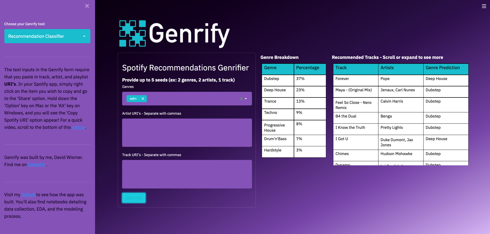

# Classification Project - EDM Subgenre Classification

For the Metis Bootcamp classification project, I was tasked with building and deploying a classification model that tackles an appropriate classification problem. I built a Streamlit web application called Genrify. The app uses a Random Forest classification model to classify songs into their most closely matched Electronic Dance Music (**EDM**) subgenre. Subgenres included Drum'n'Bass, Deep House, Dubstep, Hardstyle, Progressive House, Techno, and Trance. I tested several classification models and ultimately selected Random Forest (using 10 of 27 possible features) for its balance of classification accuracy and relative simplicity versus another top performing model in the XGBoost Classifier.

I've built Jupyter notebooks detailing Data Gathering, EDA, and Modeling. These notebooks can be found in the main repository folder, along with the streamlit application code (see genrify.py).

Follow the links below for the following resources:
- Full Project Write-up:  [Click here](https://github.com/drwismer/metis_classification_module/blob/main/writeups/project_writeup_genrify.md)
- Slide Deck:  [Part 1](https://github.com/drwismer/metis_classification_module/blob/main/writeups/genrify_slides_static_part_1.pdf),  [Part 2](https://github.com/drwismer/metis_classification_module/blob/main/writeups/genrify_slides_static_part_2.pdf)
- App Demo and Notebook Walkthrough:  Visit my [YouTube channel](https://www.youtube.com/watch?v=FcUZ94uZUzM&ab_channel=DavidWismer)

Thank you for being here!

