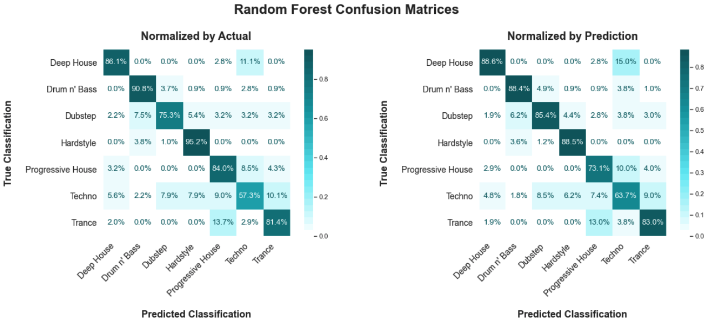
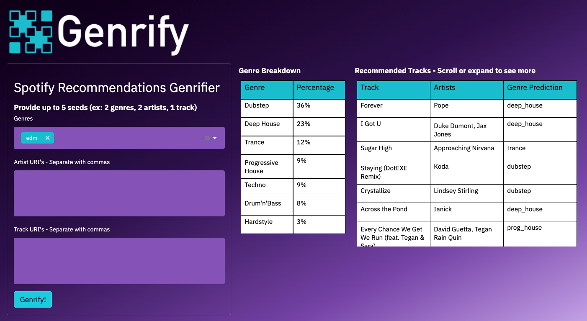

# Project MVP - Classification

I will have a web application running locally that will utilize a Random Forest model for classifying EDM songs provided either by the user or the Spotify recommendation engine. Future work will include launching the app globally. 

I ran 35,000 songs through a variety of different sci-kit learn classification models, and moved forward with hyperparameter tuning for the three models that scored highest out of the box:  1) XGBoost Classifier, 2) Random Forest Classifier, and 3) Support Vector Machine. Ultimately, I selected the tuned Random Forest Classifier model as my final model for deployment. XGBoost had a slightly better performance, but the optimal Random Forest model had reduced features, made predictions more quickly, and is a bit more interpretable than XGBoost.

Here is a confusion matrix generated from holdout data:

And here is a first look at the web application I'm calling Genrify:

