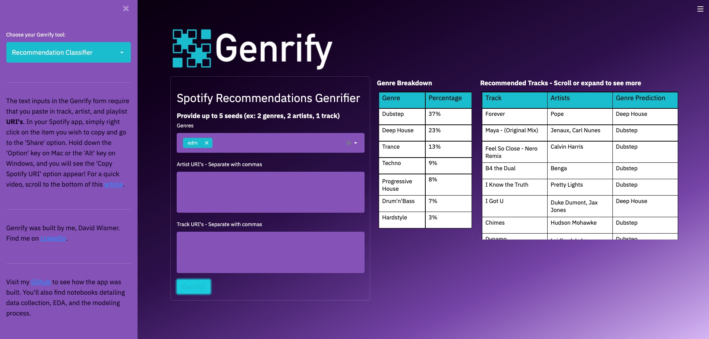

# Project Writeup

### Abstract

For the Metis Bootcamp classification project, I was tasked with building and deploying classification model that tackles an appropriate classification problem. I was required to use upwards of 10K observations and 10 features.

For my project, I built a Streamlit web application called Genrify. The app uses a Random Forest classification model to classify songs into their most closely matched Electronic Dance Music (**EDM**) subgenre. Subgenres included Drum'n'Bass, Deep House, Dubstep, Hardstyle, Progressive House, Techno, and Trance. I tested several classification models and ultimately selected Random Forest (using 10 of 27 possible features) for its balance of classification accuracy and relative simplicity versus another top performing model in the XGBoost Classifier.

The final app includes three tools:

1) **Recommendations Classifier**:  This accepts user inputs (genres, artists, and individual track ID's) and returns 100 Spotify recommended songs, along with their predicted EDM subgenre classifications.

2) **Playlist Classifier**:  This accepts a plalist ID provided by the user and returns all tracks in the playlist with their EDM subgenre predictions.

3) **Track Classifier**:  This accepts a single track ID and returns the Random Forest vote, showing the most likely EDM genre classification for the given track.

### Design

New music genres are arising at an alarming rate, particularly within the world of EDM. The initial aim of this project was to better understand the identifying characteristics behind EDM subgenres. What makes a song "Dubstep" or "Trance"? Can we predict a song's EDM subgenre through data analysis?

The ability to predict a song's most likely EDM subgenre, which I have achieved with reasonable accuracy, opens the door to several interesting use cases. The following use cases demonstrate what is possible with Genrify:
- A budding artist can generate Spotify recommendations related to her new song and "genrify" the results, thereby understanding what kind of EDM subgenres Spotify associates with her own music. 
- A country music fan might be interested in learning about EDM, but doesn't know where to start. He can generate Spotify recommendations related to the "country" genre, to his favorite country artist, or even to his favorite songs from any genre. By classifying the resulting songs by their most closely matched EDM subgenres, he may find that the "Deep House" subgenre would be a good introduction to EDM based on his own music tastes.
- A Spotify listener may have a favorite playlist that she came across, but she doesn't know what genre the music fits into. She could enter the playlist into Genrify and get a EDM subgenre breakdown, along with the individual track genre predictions, which would help her further dig into her favorite subgenres.

The future of Genrify also presents interesting possibilities for expansion. As of now, Genrify is built to classify songs into EDM subgenres, but there are many other genres of music that have several subgenres as well. I can envision additional classification models that predict subgenres within Country, Hip-Hop, R&B, or even Classical music.

### Data

I pulled audio features data from Spotify using a library called Spotipy. This required creating a Spotify developer license, which allowed me to access data through the Spotify API. I gathered data through two different methods:

1. I generated Spotify recommendations for each of my 7 EDM subgenres. This could only be done 100 recommendatitons at a time, and even through several iterations, I could only obtain approximately 1,000 recommendations for each subgenre, as each new pull may contain several duplicates from prior pulls. This method would not be sufficient for the project requirements (10K data points), so I needed another way.

2. I searched for user generated playlists that were specific to individual EDM subgenres. These were playlists with titles like "Deep House Hits" or "Hardstyle Classics" or "Top 200 Dubstep Songs of the 2000's." For the target variable, I assumed that the users correctly placed songs in appropriately titled playlists, but it should be noted that Spotify generated recommendations, while fewer in number, produced better classification accuracy scores.

Once I had all of the track URI's (Uniform Resource Indicator), I could feed these URI's back into the Spotify API to retrieve audio features. I then performed Exploratory Data Analysis and filtered out songs with extreme features that did not appear to be EDM songs at all. I removed duplicates and perfomed some other data cleaning steps that you can read about in the EDA notebook HERE.

Ultimately, I ended up with approximately 35,000 individual songs, which were split into training and testing datasets. For each of these 35,000 songs, I had 13 Spotify audio features. Some of these were categorical features requiring dummification, so I ended up with 27 features in total, though not all were used in the model deployed to the web application.

The clean data was stored in a pickle. Data was standardized using StandardScaler for models requiring standardized data. I also explored polynomial features, but the added benefit was negligible.

### Algorithms

##### ***Class Balancing***

The nature of my classification problem did not present a class imbalance issue, except that the playlists that I used to pull data did not have the same number of songs, and removing duplicates affected some subgenres more than others. For this reason, I used random sampling on my majority classes to balance to the level of my minority class.

##### ***Classification Models***

I tested several classification models out of the box, without significant parameter tuning. From the models tested, I chose three of the top performing models for additional tuning:

- **XGBoost Classifier**
- **Random Forest Classifier**
- **Support Vector Classifier** (tuning results not shown)

See below for the cross validation results for each of the untuned classification models:

My chosen metric for evaluating the models was **classification accuracy**. I also reviewed the confusion matrices to assist in picking the optimal model that balaced accuracy, simplicity, and speed.

Through additional hyperparameter tuning, I was able to achieve a maximum cross validation score of **77.0% using XGBoostClassifier**. The optimal XBoost parameters were as follows:

- **learning_rate**. 0.06
- **n_estimators** - 500
- **max_depth** - 15
- **subsample** - 0.8
- **colsample_bytree** - 0.75
- **gamma** - 1.0

With hyperparameter tuning, I was able to achieve a maximum cross validation score of **76.0% using RandomForestClassifier**. The optimal Random Forest parameters were as follows:

- **n_estimators** - The optimal number of trees for optimal performance seems to be ***more trees***. But from 1,000 to 3,000 trees, the mean R-Squared increase was around 0.002. As such, I settled on 1,000 estimators.
- **max_depth** - 30
- **min_samples_leaf** - 1 (default)
- **mix_samples_split** - 2 (default)
- **max_features** - auto (default)
- **max_features** - True (default)
- **bootstrap** - True (default)

##### ***Feature Engineering and Reduction***

Spotify provided a few categorial audio features (key, mode, time signature). These required creating dummy variables. In addition to dummy variables, I attempted creating polynomial features to the 2nd and 3rd degree. To the 2nd degree, the benefit was negligible, and to the 3rd degree, polynomial features actual had a minor negative impact on the classification accuracy. 

For this project, feature reduction was more important than engineering new features. Ultimately, all dummy variables were eliminated in the final Random Forest model. Reducing features provided the best performer of all Random Forest models, as determined using sequential forward and sequential backward feature selection. For XGBoost, the best performing model included 24 of 27 total features, but this model was ultimately not deployed.

##### ***Final Model Selection***

The final model was a **Random Forest** model including only 10 features from the original set of 27 features. The model had a cross validation score of **76.0%** and a testing score of **76.4%**, very near the peak performance of the XGBoost Classifier. The model excludes all dummy variables and all polynomial features, which eliminates the need for preprocessing of data obtained while operating the web application. If the optimal XGBoost Classifier model were used, Genrify would need to preprocess categorial variables prior to making genre predictions. This simplifies the wep application code and partially counteracts the slower performance of Random Forest versus XGBoost. I also find that Random Forest, while not the simplest of models, is easier to explain than XGBoost. In production, the Random Forest model can query Spotify for recommendations or playlist tracks, make genre predictions, and display the results for 300 songs in approximately 4 seconds.

### Tools

- **Data Collection** - Spotify API, Spotipy library
- **Data Storage** - Pickle library
- **Data Cleaning/Manipulation** - Pandas, Numpy
- **Data Visualization** - Matplotlib, Seaborn, Plotly
- **Classification Models** - Naive Bayes, Tree Classifiers, XGBoost Classifiers, KNN, Logistic Regression, Bagging, Support Vector Classifiers
    - See the Cross Validation results above for the full list of models tested
- **Production Tools** - Streamlit

### Communication

I built an attractive web application and a slide deck with a cohesive theme. My slide deck can be viewed HERE. I also included a pre-recorded demo in my presentation. An extended video showing the full functionality of Genrify can be viewed on my YouTube CHANNEL. See below for a screenshot of the Genrify landing page with the output from generating Spotify recommendations using the "edm" genre as a recommendation seed.

